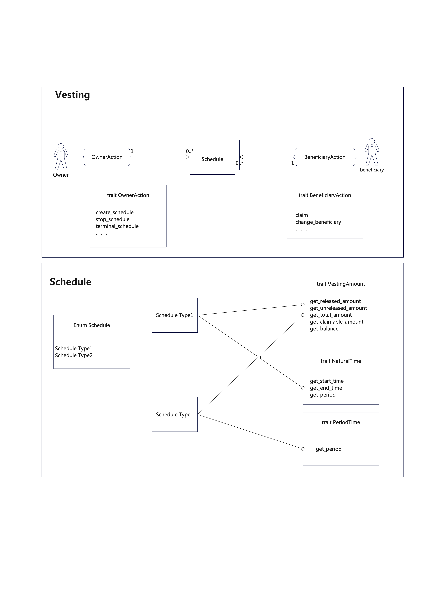
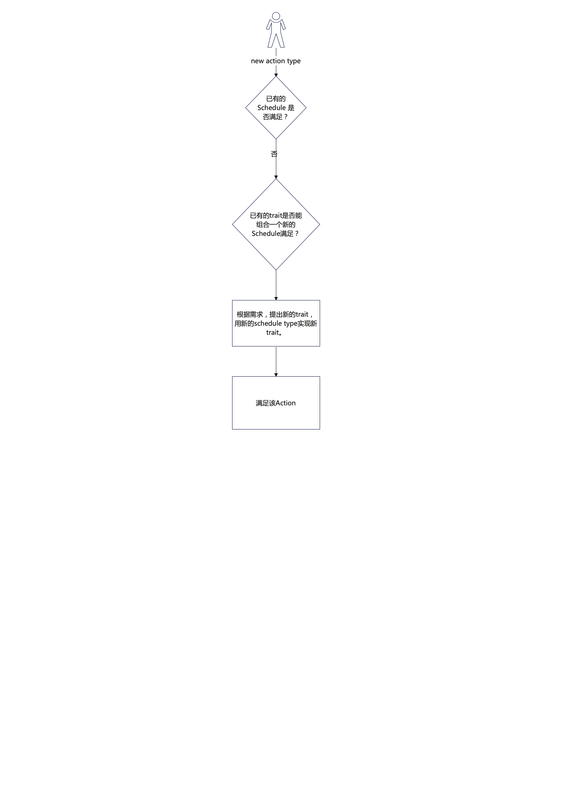

# 简介

- 这是一个基于near开发的旨在提供通用的vesting功能的合约.
- 本合约对Vesting的定义是: 权益所有者(Owner)将权益(token)分发(Schedule)给受益人(Beneficiary)。
- 合约里面有如下概念:
    - `Owner`: 权益所有者，是一个near账号。
    - `Beneficiary`: 受益人，是一个near账号。
    - `Vesting`: 权益分发合同。
      ```rust
      struct Vesting {
          owner: AccountId,
          beneficiary: AccountId,
          schedules: HashMap<ScheduleId, Schedule>,
          title: String,
          description: String
      }
      ```
    - `Schedule`: 权益分发计划(一个Vesting中可能会有多个Schedule)。
    - `OwnerAction`: `Owner`可以对 `Vesting` 或 `Schedule`执行的操作。
    - `BeneficiaryAction`: `Beneficiary`可以对 `Vesting`或 `Schedule`执行的操作。

# 图示


# Schedule
- vesting的通用性在Schedule上体现，Schedule是不同权益分发方式的集合:
```rust
pub enum Schedule {
    NaturalTimeLinearRelease
}
```
- 针对已有的一些项目，对于权益分发过程，首先总结一些trait：
  - 权益总量相关：
  ```rust
  pub trait VestingAmount {
    fn get_released_amount(&self)->Amount {
        assert!(self.get_total_amount()>=self.get_unreleased_amount(),"total amount should ge released amount.");
        self.get_total_amount()-self.get_unreleased_amount()
    }
    // 优先实现unreleased amount
    fn get_unreleased_amount(&self)->Amount;
    fn get_total_amount(&self)->Amount;
    fn get_claimable_amount(&self)->Amount {
        self.get_balance()-self.get_unreleased_amount()
    }
  }
  ```
  - 权益发放时间相关:
  ```rust
  // 自然时间
  pub trait NaturalTime {
    fn get_start_time(&self)->SecondTimeStamp;
    fn get_end_time(&self)->SecondTimeStamp;
    fn get_period(&self)->SecondTimeStamp {
        self.get_end_time()-self.get_start_time()+1
    }
  }
  ```
  or
  ```rust
   pub trait Period {
    fn get_remain_period(&self)->SecondTimeStamp;
    fn set_remain_period(&self, seconds: SecondTimeStamp);
  }
  ```
  - claim权益:
  ```rust
  pub trait Claimable {
    fn claim(&mut self);
  }
  ```
- 不同的Schedule Type实质上是不同的过程的trait的组合。

# OwnerAction & BeneficiaryAction
- Action对应权益所有者和权益受益人两方实际的需求。
- 目前已知的一些action:
  - Beneficiary可以更改Beneficiary.
  - Owner可以终止，暂停Vesting.
  。。。
- 假如有新的未满足的Action，那新增功能的一个流程: 


  - 以暂停Vesting这个新的Action实现举例:
  1. 首先在Schedule级别需要定义新的trait: Period ，只有实现了Period这种trait类型的Schedule才能暂停
  ```rust
  pub trait Period {
    fn get_remain_period(&self)->SecondTimeStamp;
    fn set_remain_period(&mut self, seconds: SecondTimeStamp);
  }
  pub trait Stop {
    fn stop(&mut self);
  }
  ```
  2. 使用定义新的Schedule Type,并实现Period和claim，stop:
  ```rust
  pub struct ReleaseByPeriod {
    remain_period: Seconds,
    token_id: AccountId,
    token_balance: Amount,
    total_amount: Amount,
  }
  impl Period for ReleaseByPeriod {
      
  }
  
  impl Claim for ReleaseByPeriod {
  }
  
  impl Stop for ReleaseByPeriod {
  }
  ```
  3. 在合约层实现OwnerAction trait的暂停的新函数. 对所有能暂停的Schedule进行暂停。 
